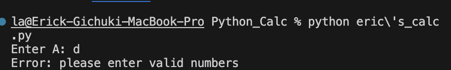

# Erick-Gichuki---Calculator-mini-app
## How to run the app
- Run ```python eric\'s_calc.py``` on your terminal to start working.
- If the user inputs non-numeric it prints error telling you to enter valid numbers.

- For the division if the user divides a number by zero it gives you an error "cannot divide by zero".